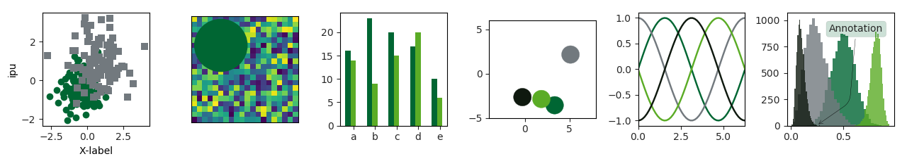

####################
IPU Matplotlib Theme
####################

The new version 2 of the Python package matplotlib changed the way theming
and colour cycles work. The code in the folder ``matplotlib-v2`` has been 
updated to work well with the new system. 

*******************
Importing the Theme
*******************

You can always install the theme to you matplotlib user library, check the 
documentation to find out more [#mpl_docs]_. If you do not want to mess 
with your Python installation, you can always load the tempklate on the
fly using the functions provided in ``ipumpl.py``. 

.. code-block:: python

  import matplotlib.pyplot as plt
  from ipumpl import temp_style_file
  with temp_style_file('ipu.mplstyle'):
        print('# before reload:', len(plt.style.available))
        plt.style.reload_library()
        print('# after reload:', len(plt.style.available))    
        # Activate default style and overwrite with IPU settings
        plt.style.use(['default', 'ipu'])

This creates a temporary copy of the ``ipu.mplstyle`` file in the 
appropriate directory and after reloading the library, the style is 
available to you using ``plt.style.use('ipu')``. The function also 
registers the colour maps ``IPU`` and ``IPU_r`` for surface and 3D plots. 

.. warning:: Note that the temporary file will overwrite any existing
  ``ipu.mplstyle`` file there is and it will be deleted afterwards.

After activating the new theme, you can use the standard plotting functions
and enjoy the new colours and other settings. For comparison, the default 
settings for matplotlib produce plots like this

  
and the new style makes the exact same plotting commands render images that 
look like this

For 3D and surface plots, the new colour maps can produce figures like this

   
but be warned, standard colour maps like ``viridis`` are still superior 
with respect to legibility and printing in greyscale. Note also that the 
default colour map has not been changed and you have to explicitly select 
the IPU colour maps if you would like to use it. 

.. [#mpl_docs] https://matplotlib.org/faq/troubleshooting_faq.html#locating-matplotlib-config-dir

   

   
